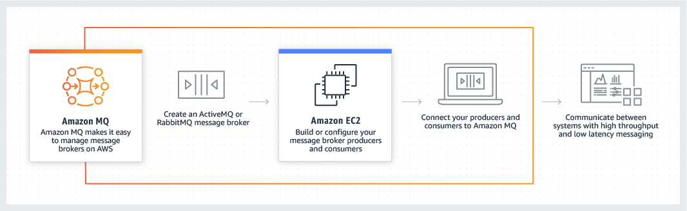

# aws-amazon-mq

## Architecture
### Amazon MQ

> Amazon MQ is a managed message broker service for Apache ActiveMQ and RabbitMQ that makes it easy to set up and operate message brokers on AWS. Amazon MQ reduces your operational responsibilities by managing the provisioning, setup, and maintenance of message brokers for you. Because Amazon MQ connects to your current applications with industry-standard APIs and protocols, you can easily migrate to AWS without having to rewrite code.

>

<!-- BEGINNING OF PRE-COMMIT-TERRAFORM DOCS HOOK -->
## Requirements

| Name | Version |
|------|---------|
| <a name="requirement_terraform"></a> [terraform](#requirement\_terraform) | >= 1.0.7 |
| <a name="requirement_aws"></a> [aws](#requirement\_aws) | >= 3.68.0 |

## Providers

| Name | Version |
|------|---------|
| <a name="provider_aws"></a> [aws](#provider\_aws) | 5.19.0 |
| <a name="provider_aws.shared"></a> [aws.shared](#provider\_aws.shared) | 5.19.0 |
| <a name="provider_random"></a> [random](#provider\_random) | 3.5.1 |

## Modules

| Name | Source | Version |
|------|--------|---------|
| <a name="module_tags"></a> [tags](#module\_tags) | git::https://gitlab.santanderbr.corp/cpf/terraform-modules/tag | master |

## Resources

| Name | Type |
|------|------|
| [aws_kms_alias.alias](https://registry.terraform.io/providers/hashicorp/aws/latest/docs/resources/kms_alias) | resource |
| [aws_kms_key.key](https://registry.terraform.io/providers/hashicorp/aws/latest/docs/resources/kms_key) | resource |
| [aws_mq_broker.amazon_mq_broker](https://registry.terraform.io/providers/hashicorp/aws/latest/docs/resources/mq_broker) | resource |
| [aws_mq_configuration.amazon_mq_broker_config](https://registry.terraform.io/providers/hashicorp/aws/latest/docs/resources/mq_configuration) | resource |
| [aws_secretsmanager_secret.admin_user_secret](https://registry.terraform.io/providers/hashicorp/aws/latest/docs/resources/secretsmanager_secret) | resource |
| [aws_secretsmanager_secret.application_user_secret](https://registry.terraform.io/providers/hashicorp/aws/latest/docs/resources/secretsmanager_secret) | resource |
| [aws_secretsmanager_secret_version.admin_user_secret_version](https://registry.terraform.io/providers/hashicorp/aws/latest/docs/resources/secretsmanager_secret_version) | resource |
| [aws_secretsmanager_secret_version.application_user_secret_version](https://registry.terraform.io/providers/hashicorp/aws/latest/docs/resources/secretsmanager_secret_version) | resource |
| [aws_security_group.this](https://registry.terraform.io/providers/hashicorp/aws/latest/docs/resources/security_group) | resource |
| [aws_security_group_rule.amqp_rule](https://registry.terraform.io/providers/hashicorp/aws/latest/docs/resources/security_group_rule) | resource |
| [aws_security_group_rule.amqp_rule_sg](https://registry.terraform.io/providers/hashicorp/aws/latest/docs/resources/security_group_rule) | resource |
| [aws_security_group_rule.mqtt_rule](https://registry.terraform.io/providers/hashicorp/aws/latest/docs/resources/security_group_rule) | resource |
| [aws_security_group_rule.mqtt_rule_sg](https://registry.terraform.io/providers/hashicorp/aws/latest/docs/resources/security_group_rule) | resource |
| [aws_security_group_rule.open_wire_rule](https://registry.terraform.io/providers/hashicorp/aws/latest/docs/resources/security_group_rule) | resource |
| [aws_security_group_rule.open_wire_rule_sg](https://registry.terraform.io/providers/hashicorp/aws/latest/docs/resources/security_group_rule) | resource |
| [aws_security_group_rule.stomp_rule](https://registry.terraform.io/providers/hashicorp/aws/latest/docs/resources/security_group_rule) | resource |
| [aws_security_group_rule.stomp_rule_sg](https://registry.terraform.io/providers/hashicorp/aws/latest/docs/resources/security_group_rule) | resource |
| [aws_security_group_rule.web_console_rule](https://registry.terraform.io/providers/hashicorp/aws/latest/docs/resources/security_group_rule) | resource |
| [aws_security_group_rule.web_console_rule_sg](https://registry.terraform.io/providers/hashicorp/aws/latest/docs/resources/security_group_rule) | resource |
| [aws_security_group_rule.wss_rule](https://registry.terraform.io/providers/hashicorp/aws/latest/docs/resources/security_group_rule) | resource |
| [aws_security_group_rule.wss_rule_sg](https://registry.terraform.io/providers/hashicorp/aws/latest/docs/resources/security_group_rule) | resource |
| [random_password.mq_admin_password](https://registry.terraform.io/providers/hashicorp/random/latest/docs/resources/password) | resource |
| [random_password.mq_application_password](https://registry.terraform.io/providers/hashicorp/random/latest/docs/resources/password) | resource |
| [aws_caller_identity.profile_shared](https://registry.terraform.io/providers/hashicorp/aws/latest/docs/data-sources/caller_identity) | data source |
| [aws_caller_identity.profile_sigla](https://registry.terraform.io/providers/hashicorp/aws/latest/docs/data-sources/caller_identity) | data source |
| [aws_iam_policy_document.key_policy](https://registry.terraform.io/providers/hashicorp/aws/latest/docs/data-sources/iam_policy_document) | data source |
| [aws_kms_key.kms_key](https://registry.terraform.io/providers/hashicorp/aws/latest/docs/data-sources/kms_key) | data source |
| [aws_kms_key.validate_kms_by_level_A_tag_cia](https://registry.terraform.io/providers/hashicorp/aws/latest/docs/data-sources/kms_key) | data source |
| [aws_vpc.vpc](https://registry.terraform.io/providers/hashicorp/aws/latest/docs/data-sources/vpc) | data source |

## Inputs

| Name | Description | Type | Default | Required |
|------|-------------|------|---------|:--------:|
| <a name="input_allowed_cidr_blocks"></a> [allowed\_cidr\_blocks](#input\_allowed\_cidr\_blocks) | (Optional) List of CIDR blocks to be allowed to connect to the cluster | `list(string)` | `[]` | no |
| <a name="input_amqp_port_enabled"></a> [amqp\_port\_enabled](#input\_amqp\_port\_enabled) | add rule in security group to allow port traffic via AMQP. | `bool` | `false` | no |
| <a name="input_app_name"></a> [app\_name](#input\_app\_name) | (Optional) App acronym of the resource. Used for Naming. (6 characters) | `string` | `null` | no |
| <a name="input_apply_immediately"></a> [apply\_immediately](#input\_apply\_immediately) | (Optional) Specifies whether any broker modifications are applied immediately, or during the next maintenance window. | `bool` | `true` | no |
| <a name="input_audit_log_enabled"></a> [audit\_log\_enabled](#input\_audit\_log\_enabled) | Enables audit logging. User management action made using JMX or the ActiveMQ Web Console is logged, only valid to ActiveMQ engine. | `bool` | `true` | no |
| <a name="input_auto_minor_version_upgrade"></a> [auto\_minor\_version\_upgrade](#input\_auto\_minor\_version\_upgrade) | (Optional) Whether to automatically upgrade to new minor versions of brokers as Amazon MQ makes releases available. | `bool` | `true` | no |
| <a name="input_deployment_mode"></a> [deployment\_mode](#input\_deployment\_mode) | (Optional) Deployment mode of the broker. Valid values are SINGLE\_INSTANCE, ACTIVE\_STANDBY\_MULTI\_AZ, and CLUSTER\_MULTI\_AZ. | `string` | `"SINGLE_INSTANCE"` | no |
| <a name="input_encryption_at_rest_kms_key_arn"></a> [encryption\_at\_rest\_kms\_key\_arn](#input\_encryption\_at\_rest\_kms\_key\_arn) | (Optional) You may specify a KMS key short ID or ARN (it will always output an ARN) to use for encrypting your data at rest. Tag CIA confidentiality Level A KMS ARN required. | `string` | `null` | no |
| <a name="input_engine"></a> [engine](#input\_engine) | (Required) Mq engine parameters. For version, refer to Readme.md. | <pre>object({<br>    version = string<br>    type    = string<br>  })</pre> | n/a | yes |
| <a name="input_entity"></a> [entity](#input\_entity) | (Optional) Santander entity code. Used for Naming. (3 characters) | `string` | `"sbr"` | no |
| <a name="input_environment"></a> [environment](#input\_environment) | (Required) Santander environment code. Used for Naming. (2 characters) | `string` | n/a | yes |
| <a name="input_function"></a> [function](#input\_function) | (Optional) App function of the resource. Used for Naming. (4 characters) | `string` | `"comm"` | no |
| <a name="input_general_log_enabled"></a> [general\_log\_enabled](#input\_general\_log\_enabled) | Enables general logging via CloudWatch. | `bool` | `true` | no |
| <a name="input_host_instance_type"></a> [host\_instance\_type](#input\_host\_instance\_type) | (Required) Host instance type and size. | `string` | `"mq.t3.micro"` | no |
| <a name="input_maintenance_day_of_week"></a> [maintenance\_day\_of\_week](#input\_maintenance\_day\_of\_week) | The maintenance day of the week. e.g. MONDAY, TUESDAY, or WEDNESDAY | `string` | `"SUNDAY"` | no |
| <a name="input_maintenance_time_of_day"></a> [maintenance\_time\_of\_day](#input\_maintenance\_time\_of\_day) | The maintenance time, in 24-hour format. e.g. 02:00 | `string` | `"03:00"` | no |
| <a name="input_maintenance_time_zone"></a> [maintenance\_time\_zone](#input\_maintenance\_time\_zone) | The maintenance time zone, in either the Country/City format, or the UTC offset format. e.g. CET | `string` | `"UTC"` | no |
| <a name="input_mq_admin_password"></a> [mq\_admin\_password](#input\_mq\_admin\_password) | Admin password | `string` | `null` | no |
| <a name="input_mq_admin_user"></a> [mq\_admin\_user](#input\_mq\_admin\_user) | Admin username | `string` | `null` | no |
| <a name="input_mq_application_password"></a> [mq\_application\_password](#input\_mq\_application\_password) | Application password | `string` | `null` | no |
| <a name="input_mq_application_user"></a> [mq\_application\_user](#input\_mq\_application\_user) | Application username | `string` | `null` | no |
| <a name="input_mqtt_port_enabled"></a> [mqtt\_port\_enabled](#input\_mqtt\_port\_enabled) | add rule in security group to allow port traffic via MQTT. | `bool` | `false` | no |
| <a name="input_openwire_port_enabled"></a> [openwire\_port\_enabled](#input\_openwire\_port\_enabled) | add rule in security group to allow port traffic via OpenWire. | `bool` | `false` | no |
| <a name="input_profile_shared"></a> [profile\_shared](#input\_profile\_shared) | (Required) AWS Profile for Shared Account. | `string` | n/a | yes |
| <a name="input_profile_sigla"></a> [profile\_sigla](#input\_profile\_sigla) | (Required) AWS Profile for Sigla/Channel Account. | `string` | n/a | yes |
| <a name="input_region"></a> [region](#input\_region) | (Optional) Region where the resource will be launched. | `string` | `"sa-east-1"` | no |
| <a name="input_resource_sequence"></a> [resource\_sequence](#input\_resource\_sequence) | (Required) Sequence number of the resource. If you have more than one resource, send the sequence accordingly so that names dont clash. | `number` | n/a | yes |
| <a name="input_secret_name"></a> [secret\_name](#input\_secret\_name) | (Optional) Name of the secret on secret manager to save user and password. | `string` | `null` | no |
| <a name="input_security_groups"></a> [security\_groups](#input\_security\_groups) | (Optional) List of security group IDs to be allowed to connect to the cluster | `list(string)` | `[]` | no |
| <a name="input_shared_account_region"></a> [shared\_account\_region](#input\_shared\_account\_region) | (Optional) Shared account region. Will use this account kms. | `string` | `"sa-east-1"` | no |
| <a name="input_stomp_port_enabled"></a> [stomp\_port\_enabled](#input\_stomp\_port\_enabled) | add rule in security group to allow port traffic via STOMP. | `bool` | `false` | no |
| <a name="input_subnet_ids"></a> [subnet\_ids](#input\_subnet\_ids) | (Required) Subnet IDs for Client Broker. | `list(string)` | n/a | yes |
| <a name="input_tags"></a> [tags](#input\_tags) | (Requires) Tags as defined by Global: https://confluence.alm.europe.cloudcenter.corp/x/XEGqCg | `map(string)` | n/a | yes |
| <a name="input_vpc_id"></a> [vpc\_id](#input\_vpc\_id) | (Required) Vpc id where the resource will be launched. | `string` | n/a | yes |
| <a name="input_websocket_port_enabled"></a> [websocket\_port\_enabled](#input\_websocket\_port\_enabled) | add rule in security group to allow port traffic via WebSocket. | `bool` | `false` | no |

## Outputs

| Name | Description |
|------|-------------|
| <a name="output_instance"></a> [instance](#output\_instance) | n/a |
<!-- END OF PRE-COMMIT-TERRAFORM DOCS HOOK -->

## Usage

```hcl
module "amazon_mq" {
  source = "git::https://gitlab.santanderbr.corp/cpf/terraform-modules/aws-amazon-mq.git?ref=$VERSION"

  // AWS CONNECTIONS
  profile_sigla         = "SIGLA-ENVIRONMENT"
  profile_shared        = "SharedProfile"
  region                = "sa-east-1"
  shared_account_region = "sa-east-1"

  // NAMING
  entity            = "sbr"
  app_name          = null
  function          = "comm"
  environment       = "d1"
  resource_sequence = 1

  # TAGGING
  purpose = "NORMALMENTE A SIGLA DE ESTRUTURANTE OU ALGUMA OUTRA INFORMAÇÃO"
  req     = "REQ000000000"
  tags = {
    cia         = "BLC"
    channel     = "t05"
    cost_center = "t05"
    description = "t05"
    product     = "teste"
    sigla       = "cpf" 
  }

  host_instance_type = "mq.m5.large"
  engine = {
    type     = "ActiveMQ"
    version  = "5.16.3"
  }
  
  deployment_mode            = "ACTIVE_STANDBY_MULTI_AZ"
  apply_immediately          = true
  auto_minor_version_upgrade = true

  // Network
  vpc_id                     = "vpc-xxxxxxxxxxxxxxxxx"
  subnet_ids                 = ["subnet-xxxxxxxxxxxxxxxxx","subnet-xxxxxxxxxxxxxxxxx"]
  allowed_cidr_blocks        = ["xxx.xxx.xxx.xxx/xx"]

  amqp_port_enabled          = true
  mqtt_port_enabled          = false
  openwire_port_enabled      = false
  stomp_port_enabled         = false
  websocket_port_enabled     = false

  // LOGGING
  general_log_enabled        = true
  audit_log_enabled          = true

  // Backup
  maintenance_day_of_week    = "SUNDAY"
  maintenance_time_of_day    = "03:00"
  maintenance_time_zone      = "UTC"

}

```

## Instance size

For more information consult [Amazon Mq Documentation on instances](https://docs.aws.amazon.com/amazon-mq/latest/developer-guide/broker-instance-types.html)

The mq.t2.micro	and mq.m4.large	instace types are deprecated, and therefore not included in this blueprint as valid instance types.

## Instance type and version

For available versios and types, consult [RabbitMQ versions](https://docs.aws.amazon.com/amazon-mq/latest/developer-guide/rabbitmq-version-management.html) or [ActiveMQ versions](https://docs.aws.amazon.com/amazon-mq/latest/developer-guide/activemq-version-management.html).

# **Security Framework**
This section explains how the different aspects to have into account in order to meet the Security Control for Cloud for this Certified Service. 

## CERTIFICATE LEVEL: ADVANCED
## Security Controls based on Security Control for Cloud

### Foundation (**F**) Controls for Rated Workloads
|SF#|What|How it is implemented in the Product|Who|
|--|:---|:---|:--|
|SF1|IAM on all accounts|IAM permissions based on [roles](https://docs.aws.amazon.com/pt_br/amazon-mq/latest/developer-guide/security-iam.html)|CCoE <br> Entity|
|SF2|MFA on accounts|This is governed by AWS IAM|CISO <br> CCoE <br> Entity|
|SF3|Platform Activity Logs & Security Monitoring|Platform logs and security monitoring provided by Platform. [CloudWatch/CloudTrail](https://docs.aws.amazon.com/pt_br/amazon-mq/latest/developer-guide/security-logging-monitoring-configure-cloudwatch.html) and [Monitoring](https://docs.aws.amazon.com/pt_br/amazon-mq/latest/developer-guide/security-logging-monitoring.html)|CCoE <br> Entity <br> CISO|
|SF4|Virus/Malware Protection on IaaS|No antivirus protection for Amazon MQ|CCoE <br> Entity <br> CISO|
|SF5|Authenticate all connections|N/A|CCoE Entity|</span>
|SF6|Isolated environments at network levels|The AWS global infrastructure is built around AWS Regions and Availability Zones. AWS Regions provide multiple physically separated and isolated Availability Zones, which are connected with low-latency, high-throughput, and highly redundant networking. [Amazon MQ Resilience](https://docs.aws.amazon.com/pt_br/amazon-mq/latest/developer-guide/disaster-recovery-resiliency.html)|CCoE <br> CISO <br> Entity |
|SF7|Security Configuration & Patch Management|As a managed service, Amazon MQ is protected by the AWS global network security procedures described in the [Amazon Web Services: Overview of Security Processes whitepaper](https://d0.awsstatic.com/whitepapers/Security/AWS_Security_Whitepaper.pdf)|CCoE <br> Entity|
|SF8|Privileged Access Management|IAM permissions based on roles|CCoE <br> CISO|

### Medium (**M**) Controls for Rated Workloads
|SM#|What|How it is implemented in the Product|Who|
|--|:---|:---|:--|
|SM1|IAM| Use IAM/RBAC configuration. (Use IAM roles for applications and AWS services which require Amazon MQ access)|CCoE <br> Entity|
|SM2|Encrypt data at rest|Amazon MQ integrates with AWS Key Management Service (KMS) to offer transparent server-side encryption. Amazon MQ always encrypts your data at rest. User data stored in Amazon MQ is encrypted at rest. <br>Amazon MQ encryption at rest provides enhanced security by encrypting your data using encryption keys stored in the AWS Key Management Service (KMS). This service helps reduce the operational burden and complexity involved in protecting sensitive data. With encryption at rest, you can build security-sensitive applications that meet encryption compliance and regulatory requirements. [Data protection in Amazon MQ](https://docs.aws.amazon.com/amazon-mq/latest/developer-guide/data-protection.html)|CCoE|
|SM3|Encrypt data in transit over private interconnections|All connections between Amazon MQ brokers use Transport layer Security (TLS) to provide encryption in transit. <br> Amazon MQ encrypts messages at rest and in transit using encryption keys that it manages and stores securely. For more information, see the [AWS Encryption SDK Developer Guide](https://docs.aws.amazon.com/encryption-sdk/latest/developer-guide/introduction.html).|Entity <br> CCoE|
|SM4|Control resource geographical location|The region where the MQ is created is previously define as a variable in Terraform code. The current support values are sa-east-1 and us-east-1.|CCoE <br> CISO|
|SM5|Privileged Access Management|Covered by SF1, SF2 and SF3|CCoE <br> CISO|

### Application (**P**) Controls for Rated Workloads
|SP#|What|How it is implemented in the Product|Who|
|--|:---|:---|:--|
|SP1|Resource tagging for all resources|The implementation will be done using a terraform module following the references to [HCF Naming and Tagging Chapter v1.3](https://confluence.ci.gsnet.corp/x/l7IiCQ)|CCoE <br> CISO|
|SP2|Segregation of Duties| Use IAM/RBAC configuration.|CCoE <br> CISO <br> Entity|
|SP3|Vulnerability Management| Detect is responsible for vulnerability scanning of public endpoints |CCoE <br> CISO <br> Entity|
|SP4|Service Logs & Security Monitoring|Amazon MQ is integrated with AWS CloudTrail, you can capture API calls for Amazon MQ as events. Amazon MQ and CloudWatch are integrated so you can collect, view, and analyze metrics for every active Amazon MQ. For more information, see the [Logging and monitoring](https://docs.aws.amazon.com/amazon-mq/latest/developer-guide/security-logging-monitoring.html).|CCoE <br> Entity <br> CISO|
|SP5|Network Security|Security groups control the access that traffic has in and out of a Amazon MQ instance.|CCoE <br> Entity <br> CISO|
|SP5.1| Inbound and outbound traffic: CSP Private zone to Santander On-premises| Protection between zones provided by platform.|
|SP5.2| Inbound and outbound traffic: between CSP Private zones of different entities| Protection between zones provided by platform.|
|SP5.3| Inbound and outbound traffic: between CSP Private zones of the same entity | N/A|
|SP5.4| Inbound traffic: Internet to CSP Public zone |N/A
|SP5.5| Outbound traffic: From CSP Public/Private zone to Internet | N/A|
|SP5.6| Control all DNS resolutions and NTP consumption in CSP Private zone| N/A
|SP6|Advanced Malware Protection on IaaS|N/A. Nothing can be done from the terraform automation.|CCoE <br> Entity <br> CISO|
|SP7|Cyber incidents management & Digital evidences gathering|Capacity provided from TLZ.|CISO <br> Entity|
|SP8|Encrypt data in transit over public interconnections|Depend of Development team|Entity <br> CCoE|
|SP9|Static Application Security Testing (SAST)| Evaluated by Sentinel (Terraform Enterprise) and by Dome9 (Check Point) | Entity|


### Advanced (**A**) Controls for Rated Workloads
|SM#|What|How it is implemented in the Product|Who|
|--|:---|:---|:--|
|SA1|IAM| IAM permissions based on [roles](https://docs.aws.amazon.com/pt_br/amazon-mq/latest/developer-guide/security-iam.html). Access is based on the principle of least privilege assigned to roles. The role will be passed as IAM policies out of the module|CCoE <br> Entity|
|SA2|Encrypt data at rest|Amazon MQ integrates with [AWS Key Management Service](https://docs.aws.amazon.com/kms/latest/developerguide/overview.html) (KMS) to offer transparent server-side encryption. Amazon MQ always encrypts your data at rest. When you create an MQ cluster, you can specify the AWS KMS customer master key (CMK) that you want Amazon MQ to use to encrypt your data at rest. If you don't specify a CMK, Amazon MQ creates an [AWS managed CMK](https://docs.aws.amazon.com/kms/latest/developerguide/concepts.html#aws-managed-cmk) for you and uses it on your behalf. For more information about CMKs, see [Customer Master Keys (CMKs)](https://docs.aws.amazon.com/kms/latest/developerguide/concepts.html#master_keys) in the AWS Key Management Service Developer Guide.|CCoE|
|SA3|Encrypt data in transit over private interconnections| Amazon MQ uses TLS 1.2. By default, it encrypts data in transit between brokers in your MQ cluster. You can override this default at cluster creation time. Amazon MQ is configured to only allow TLS encrypted data. This is the default setting.|Entity <br> CCoE|
|SA4|Santander managed keys with HSM and BYOK|Possible by configuring a BYOK key ARN|CCoE <br> CISO <br> Entity|
|SA5|Control resource geographical location|Certified Product location can be configured using product deployment parameters|CCoE <br> CISO|
|SA6|Cardholder and auth sensitive data| N/A. Provided by the environment.|Entity|
|SA7|Access control to data with MFA|N/A. Provided by the environment.|CISO <br> CCoE <br> Entity|


### Critical (**C**) Controls for Rated Workloads
|SM#|What|How it is implemented in the Product|Who|
|--|:---|:---|:--|
|SC1|Pen-testing|N/A. Pen-testing in AWS is not allowed to be done at any certain moment for all their [services](https://aws.amazon.com/es/security/penetration-testing/).|CISO <br> Entity|
|SC2|Threat Model|N/A. AWS marketplace ofers some solutions from third party entities. ThreatModeler is a leading platform that automates the process to create a threat model, reducing the time-cost needed by up to 85%. |CCoE|
|SC3|RedTeam| N/A.|CISO|
|SC4|Dynamic Application Security Testing (DAST)|N/A. [Amazon Inspector](https://docs.aws.amazon.com/es_es/inspector/latest/userguide/inspector_introduction.html) automatically assesses applications for exposure, vulnerabilities, and deviations from best practices. After performing an assessment, Amazon Inspector produces a detailed list of security findings prioritized by level of severity. These findings can be reviewed directly or as part of detailed assessment reports which are available via the Amazon Inspector console or API. |Entity|


# **Basic tf files description**

This section explain the structure and elements that represent the artifacts of product.

|Folder|Name|Description
|--|:-|--|
|Documentation|amazon-mq-diagram.jpg|Architecture diagram|
|Root|README.md|Product documentation file|
|Root|main.tf|Terraform file to use in pipeline to build and release a product|
|Root|outputs.tf|Terraform file to use in pipeline to check output|
|Root|variables.tf|Terraform file to define variables|


## Authors

Module written by CCoE

